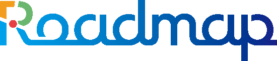

  

# Welcome to Roadmap 👋

## About Us

로드맵은 AI 딥러닝 기술, 무선 통신 기술, 빅데이터 분석 기술을 기반으로 혁신적인 기술 솔루션을 개발하는 소프트웨어 개발 회사입니다. 우리는 최신 기술을 활용하여 고객에게 가치 있는 서비스를 제공합니다.

## Our Products & Solutions

### 🚗 Smart City Solutions
- **주차 정보 시스템**: AI 기반 실시간 주차 관리 및 안내 시스템
- **이륜차 단속 시스템**: 딥러닝 영상 분석을 통한 지능형 단속 솔루션
- **스마트 횡단보도**: IoT 센서와 AI를 활용한 보행자 안전 시스템
- **스마트 버스정류장**: 실시간 정보 제공 및 승객 편의 기반 시설

### 📦 Industry Solutions
- **콜드체인**: 온도 모니터링 및 물류 추적 시스템
- **스마트 수위 감시 시스템**: IoT 기반 실시간 수위 모니터링 및 경보 시스템

## Our Tech Stack

### 🎨 Frontend
- React, Vue.js, Next.js
- TypeScript, JavaScript
- Tailwind CSS, Material-UI
- React Native, Flutter

### ⚙️ Backend
- Node.js, Express, Nest.js
- Java, Spring Boot
- Python, Django/FastAPI
- Go, Kotlin

### 💾 Database & Storage
- PostgreSQL, MySQL
- MongoDB, Redis
- Elasticsearch
- Amazon S3

### 🚀 DevOps & Infrastructure
- Docker, Kubernetes
- GitHub Actions, Jenkins
- AWS, GCP, Azure
- Terraform, Ansible

### 🛠️ Tools & Practices
- Git, GitHub
- Notion, Slack
- Agile/Scrum
- CI/CD, TDD

## Development Culture

- ✨ **코드 품질**: 클린 코드와 베스트 프랙티스 추구
- 🔄 **지속적 개선**: 애자일 방법론과 지속적인 학습
- 👥 **협업**: 코드 리뷰와 페어 프로그래밍
- 🎯 **성과 중심**: 비즈니스 가치 창출에 집중
- 🌱 **성장**: 개발자 성장을 위한 교육과 지원

## Development Guidelines

팀 내부 개발 가이드라인:

- 📝 [Commit Convention](COMMIT_CONVENTION.md) - 커밋 메시지 작성 규칙

## Contact

문의사항이나 협업 제안이 있으신가요?

- 🌐 Website: [https://roadmap.ne.kr/](https://roadmap.ne.kr/)
- 📧 Email: contact@roadmap.ne.kr
- 💼 채용 문의: recruit@roadmap.ne.kr

---

*세상을 키우는 힘, 여러분과 함께 하겠습니다* ✨
